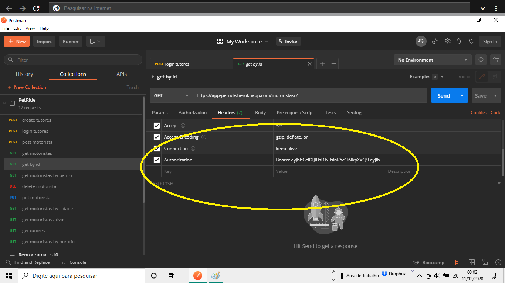

<h1 align="center">
    <br>
    <p align="center">Projeto Final {Reprograma} - PetRide<p>
</h1>


<p align="center">
  <a> 
    
    
    
    
    <a href="https://app-petride.herokuapp.com/"></a>
  </a>
</p>

### Proposta do Projeto PetRide:

O projeto PetRide é uma API REST que permite que tutores de pets ou ONGs possam se cadastrar e realizar buscas por motoristas que oferecem ajuda no transporte solidário de animais. 

A interface será um CRUD completo integrado com um banco de dados, onde será possível listar os motoristas cadastrados na base de dados; cadastrar novos motoristas; atualizar dados; visualizar horários, dias disponíveis e bairros onde o motorista se propõe a transportar.

**E Como funciona?**

O tutor ou a ONG deve fazer o login no sistema onde será gerado um TOKEN, que viabilizará acessar as rotas do banco de dados. Caso o TOKEN não seja igual, o usuário receberá uma mensagem de erro.
## Recursos e tecnologias utilizadas para a construção da API:

* **Node.Js** - versão 12.18.3;
* Gerenciador de pacotes Node.Js **npm** - versão 6.14.6;
* Dependências Node.Js:
   * **Express** - versão 4.17.1;
   * **Mongoose** - versão 5.10.17;
   * **Dotenv-safe** - versão 8.2.0;
   * **Jsonwebtoken** - versão 8.5.1;
   * **Bcrypt** - versão 5.0.0;
   * **Nodemon** - versão 2.0.6;
* **MongoDB**;
* **MongoDB Atlas**;
* **Visual Studio Code**;
* **Postman**;
* **Heroku**;

## Como usar este projeto:

## Testando as rotas na sua máquina:

1. Abra o aplicativo [POSTMAN](https://chrome.google.com/webstore/detail/postman/fhbjgbiflinjbdggehcddcbncdddomop/related?hl=pt-BR);

2. Teste as rotas usando este endereço na URL do Postman: https://app-petride.herokuapp.com/ na URL do POSTMAN.

3. As rotas/endpoints só estarão disponiveis após o cadastro do tutor e registro de uma senha de acesso. Para isso deve-se usar a URL https://app-petride.herokuapp.com/tutores no Postman cadastrar o tutor, clicando em *body* e posteriormente em *raw*, para trocar a combobox "text" para *JSON* e apertar *Send*.

4. Após cadastro, o tutor deve fazeer login através da URL https://app-petride.herokuapp.com/tutores/login e copiar o TOKEN gerado como *result* do Postman após o envio da requisição.

4. O TOKEN é o que dará permissão para acessar os endpoints dos motoristas, para isso deve-se criar um *header* chamado "Authorization" e passar como valor "Bearer + TOKEN copiado". Conforme imagem:


## Criar seu próprio Banco de Dados:

1. Clone o projeto através do comando:
`$git clone https://github.com/Audry-prog/projeto-final-backend-reprograma.git`

2. Inicialize o package.json com todas as configurações do projeto através do comando:
`$npm install`

3. Inicialize o servidor do projeto com o comando:
`$npm start`

4. Renomeie o arquivo `.env.exemple` para `.env` e crie as variáveis de ambiente.

5. Para criar a variável SECRET do arquivo `.env`, gere uma chave pública RSA atravé do site https://travistidwell.com/jsencrypt/demo/

## Arquitetura da API:

```
├── src
│   ├── controllers
|   |  ├── motoristasController.js
|   |  ├── tutoresController.js
│   ├── models
|   |  ├── motoristas.js
|   |  ├── tutores.js
│   ├── routes 
│   |  ├── index.js
|   |  ├── index.js
│   |  ├── motoristasRoute.js
|   |  ├── tutoresRoute.js
|   ├── app.js
├── .env.example
├── package.json
├── server.js
```
## Mannipulação das Rotas de Motoristas:

| Método HTTP | Endpoint                     | Descrição                               |
| ----------- | ---------------------------- | --------------------------------------- |
| POST        | `/motoristas`                | Cria um novo motorista                  |
| GET         | `/`                          | Retorna todos os motoristas por bairro  |
| GET         | `/motoristas/motoristas`     | Retorna todos os motoristas             |
| GET         | `/motoristas/:id`            | Retorna um motorista específico por id  |
| GET         | `/motoristas/cidade`         | Retorna todos os motoristas por cidade  |
| GET         | `/motoristas/ativos`         | Retorna todos os motoristas por ativos  |
| GET         | `/motoristas/horarios`       | Retorna todos os motoristas por horário |
| PUT         | `/motoristas/:id`            | Altera informações de um motorista      |
| DELET       | `/motoristas/:id`            | Remove um motorista específico          |

## Manipulação das Rotas dos Tutores:

| Método HTTP | Endpoint                     | Descrição                               |
| ----------- | ---------------------------- | --------------------------------------- |
| POST        | `/tutores`                   | Cria um novo tutor no Banco de Dados    |
| POST        | `/tutores/login`             | Autoriza o acesso ao Banco de Dados     |
| GET         | `/tutores`                   | Retorna todos os tutores cadastrados    |

## Futuras melhorias:

A ideia para a API PetRide é que no futuro o tutor possa solicitar viagem para o motorista cadastrado e a API tenha suas rotas integradas com geolocalização. 

Caso queira contribuir com meu projeto, será totalmente bem-vindo!!!